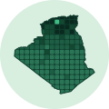

<p align="center">
  
</p>

<h1 align="center">djazair.dev</h1>

<p align="center"><em>Growing Algeria's developer ecosystem</em></p>

djazair.dev is an open-source community project with two parts:

- **Algeria Developer Index**: Algeria's GitHub activity compared with similar countries, updated every quarter from [GitHub Innovation Graph](https://github.com/github/innovationgraph) data.
- **Project Hub**: open-source projects by Algerian developers, or relevant to Algeria, with beginner-friendly issues to start on.

The site will be in Arabic and English. The first version has no accounts and collects no personal data.

**Status:** pre-launch. The first version is planned for 30 November 2026. The [implementation plan](docs/implementation-plan.md) lists the work, and [#1](https://github.com/djazairdev/djazair.dev/issues/1) tracks it.

## Repository layout

| Path | What it holds |
|---|---|
| `pipeline/` | Python: downloads Innovation Graph releases and computes the Index |
| `hub/` | Python: syncs Hub projects and runs inclusion and health checks |
| `data/raw/` | Archived source files, with checksums |
| `data/derived/` | Published indicators (CSV and JSON) |
| `projects.yml` | The Hub registry |
| `site/` | The static website |
| `content/` | Quarterly reports and the meetups section |
| `docs/` | The implementation plan, the page designs, [how deploys work](docs/deploy.md), [accessibility](docs/accessibility.md), [performance](docs/performance.md), the [Arabic review](docs/arabic-review.md), [quarterly reports](docs/reports.md), [Hub ideas](docs/hub-ideas.md) and the [launch](docs/launch.md) |
| `.github/workflows/` | Scheduled jobs and deployment |

## Run it locally

Everything is Python 3.12+ with the standard library only; there's nothing to install.

```sh
python3 site/build.py                                                # build the site into site/dist
python3 -m http.server 4322 --bind 127.0.0.1 --directory site/dist   # preview at http://localhost:4322/
python3 -m unittest discover -s tests                                # run the tests
```

## Contributing

See [CONTRIBUTING.md](CONTRIBUTING.md). To report a security problem, see [SECURITY.md](SECURITY.md).

## Licences

- Code: [MIT](LICENSE)
- Text and charts: [CC BY 4.0](LICENSE-content)
- Derived data: [CC0 1.0](LICENSE-data)

The djazair.dev name and logo are not covered by these licences.

Data: GitHub Innovation Graph (CC0). djazair.dev is an independent community project. It is not affiliated with or endorsed by GitHub.
